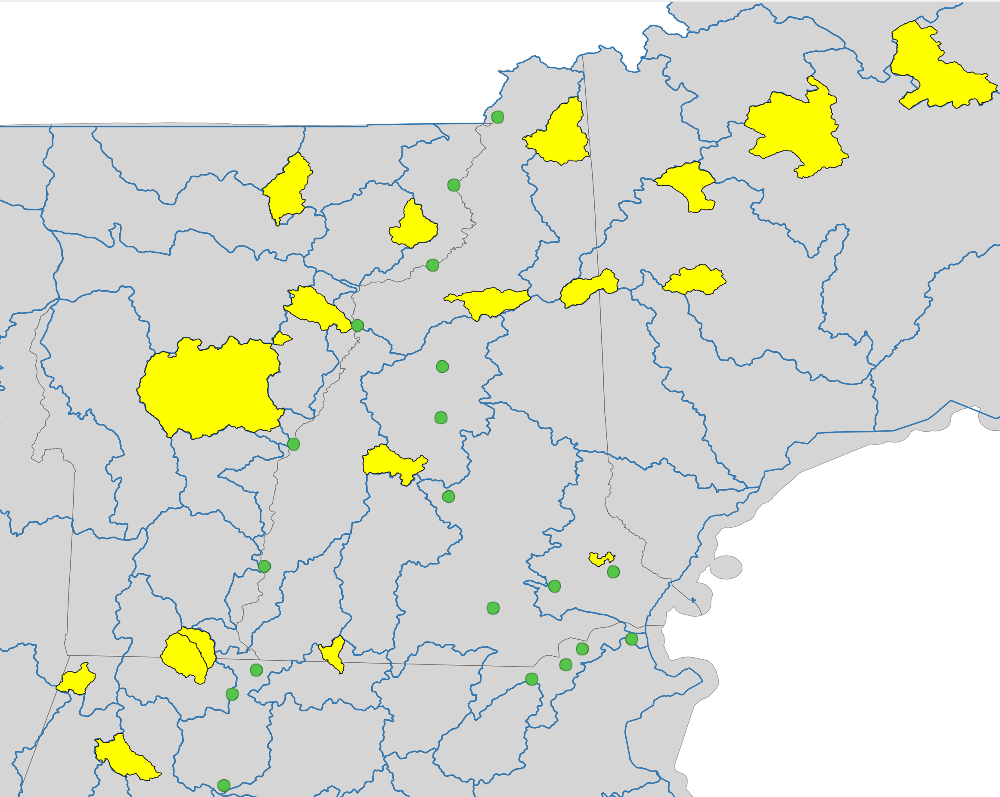

```{r setup, message=FALSE, }
knitr::opts_chunk$set(echo = TRUE)

library(tidyverse)
library(ggplot2)
library(lubridate) # for dates
library(janitor) # clean column names

library(CamelsQuery)  # remotes::install_github("brunj7/CamelsQuery")
```

## Import sites to process

```{r}

```

```{r sites}
# Read the test sites

# # Test sites
# sites <- read_csv("testing-sites.csv") %>% 
#   pull(hru_id)

# HUC 1 sites
sites <- readr::read_csv("huc1_sites.txt", col_names = FALSE) %>% pull()

```

## Get the CAMELS data for those sites

```{r camels}
# directories
main_dir <- "/home/shares/camels/"
my_basin_dir <- file.path(main_dir, "basin_dataset_public_v1p2")
my_attr_dir <- file.path(main_dir, "camels_attributes_v2.0")


# Read the CAMELS forcing
# this returns a named list object with 9 items
camels_data <- extract_huc_data(basin_dir = my_basin_dir, 
                         attr_dir = my_attr_dir, 
                         huc8_names = sites)

```

## Get the USGS data for those sites
```{r usgs}
usgs_data <- get_sample_data(sites) # takes some time

```


```{r Read the data and format similar to CAMELS} 
## Discharge

usgs_q <- usgs_data$discharge %>%
  select(site_no, Date, X_00060_00003, X_00060_00003_cd ) %>%
  rename(discharge_cfs = X_00060_00003) %>%
  rename(discharge_cfs_qflag = X_00060_00003_cd) 


## Water Quality

# Remove the unwanted fields
# Read the list
chem_cols_drop <- read_csv("chem_fields_drop.csv") %>%
  separate(field_drop,c("number", "name"), sep = "-") %>%
  mutate(name = stringr::str_trim(name))

# Drop the fields
usgs_chem <- usgs_data$water_q %>%
  select(-chem_cols_drop$name)

# Quick check
cat("checking dimensions\n")
nrow(chem_cols_drop)
dim(usgs_data$water_q)
dim(usgs_chem)

```

```{r}

# Get the flow from chemistry data
usgs_chem_q <- usgs_chem %>%
  filter(str_detect(CharacteristicName,"flow")) %>%    # keep some room for other potential types of flow
  select(MonitoringLocationIdentifier, ActivityStartDate, ActivityStartTime.Time, ActivityStartTime.TimeZoneCode,HydrologicCondition, HydrologicEvent, CharacteristicName, ResultMeasureValue, ResultMeasure.MeasureUnitCode) %>%
  separate(MonitoringLocationIdentifier, c("Organization", "site_no"), sep = "-")

# Combine it with the flow
all_q <- left_join(usgs_q, usgs_chem_q, by = c("site_no","Date" = "ActivityStartDate")) %>%
  mutate(flow_diff = discharge_cfs - ResultMeasureValue)

ggplot(all_q) +
  geom_point(aes(Date, flow_diff)) + 
  facet_wrap(vars(site_no)) + 
  ggtitle(" Discharge diff USGS daily - USGS chem ") + 
  theme_bw()
```
It has been noted that all the stream data associated with chemistry samples are old (prior 1995 and a lot of sixties and seventies). Maybe this practice is not happening anymore or they changed the discharge code that is used. TBD

```{r}
ggplot(usgs_q) +
  geom_point(aes(Date, discharge_cfs)) + 
  facet_wrap(vars(site_no)) + 
  ggtitle(" Discharge USGS") + 
  theme_bw()


```

```{r}
# Read the data and format similar to CAMELS

camels_q <- camels_data$usgs_streamflow %>%
  mutate(Date = make_date(Year, Mnth, Day)) %>%
  rename(site_no= ID) %>%
  mutate(site_no = paste0("0", site_no))

ggplot(camels_q) +
  geom_point(aes(Date, discharge_cfs)) + 
  facet_wrap(vars(site_no)) +
  ggtitle(" Discharge CAMELS") + 
  theme_bw()


```
## Comparing the flows

```{r comparison}

data_full <-  full_join(camels_q, usgs_q, by = c("site_no", "Date"))

data_full <- data_full %>%
  mutate(diff_q = discharge_cfs.y - discharge_cfs.x) # USGS - CAMELS

ggplot(data_full) +
  geom_point(aes(Date, diff_q)) + 
  facet_wrap(vars(site_no)) + 
  ggtitle(" Discharge USGS - CAMELS") + 
  theme_bw()

```
**We can see that CAMELS has not been updated recently**

## Writing csv files

```{r csv, eval = FALSE}

# Discharge
# write_csv(camels_q, "data/camels_discharge_test_sites.csv")
write_csv(all_q, file.path(main_dir, "output/usgs_discharge_huc1_sites.csv"))

# Water Quality
# removing the stream flow since it was added to the main stream flow file
usgs_chem <- usgs_chem %>%
  filter(!str_detect(CharacteristicName,"flow"))

# Write the file
write_csv(usgs_chem, file.path(main_dir, "output/usgs_waterq_huc1_sites.csv"))

# Sites info
write_csv(usgs_data$sites, file.path(main_dir,"output/usgs_huc1_sites.csv"))

# Camels forcing
write_csv(camels_data$mean_forcing_daymet, file.path(main_dir,"output/camels_forcing_huc1_sites.csv"))

# Camels attributes
write_csv(camels_data$camels_clim, file.path(main_dir,"output/camels_att_clim_huc1_sites.csv"))
write_csv(camels_data$camels_geol, file.path(main_dir,"output/camels_att_geol_huc1_sites.csv"))
write_csv(camels_data$camels_soil, file.path(main_dir,"output/camels_att_soil_huc1_sites.csv"))
write_csv(camels_data$camels_topo, file.path(main_dir,"output/camels_att_topo_huc1_sites.csv"))
write_csv(camels_data$camels_vege, file.path(main_dir,"output/camels_att_vege_huc1_sites.csv"))

```

